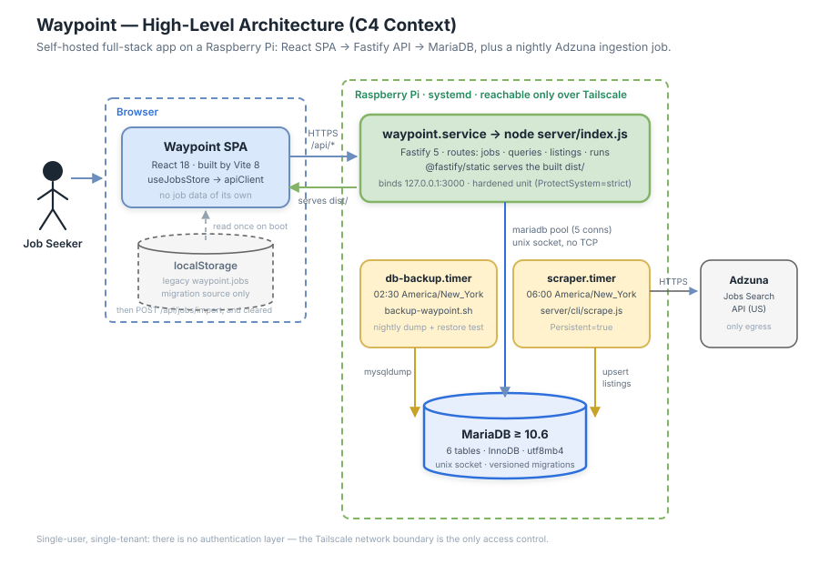
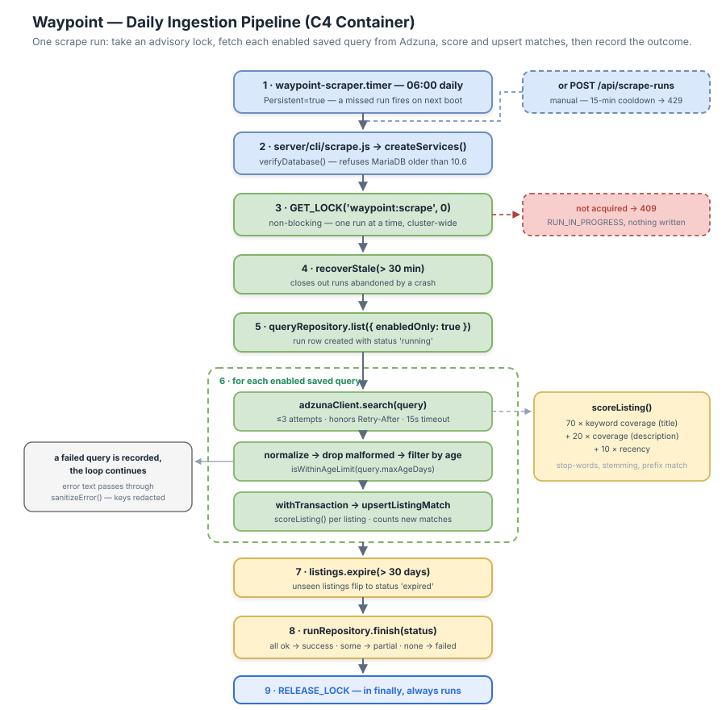
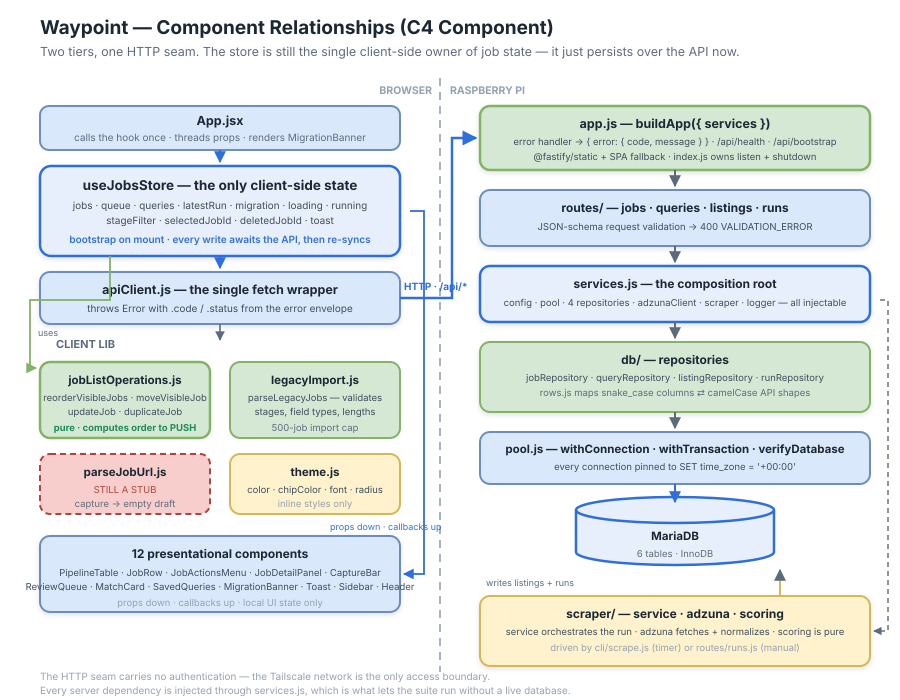

# Waypoint — Project Summary

## 1. Executive Summary

Waypoint is a self-hosted job search manager. It tracks job applications through a pipeline, and every morning it ingests fresh job listings from the Adzuna API, scores them against your saved queries, and drops the good ones into a review queue.

It is a **full-stack application designed to run on a single Raspberry Pi**: a React single-page app served by a Fastify API, backed by MariaDB, with two systemd timers — one that scrapes at 06:00 and one that backs up the database at 02:30. It is reachable only over Tailscale.

The system is deliberately **single-user and single-tenant**. There is no authentication, no accounts, and no multi-tenancy: the private network *is* the access control. That assumption is what keeps the code small — roughly 2,800 lines across 21 client and 22 server files, with five runtime dependencies.

Its defining engineering characteristics are **a scrape run that cannot overlap** (a MariaDB advisory lock plus a manual-trigger cooldown), **failure isolation per query** (one bad query is recorded and the loop continues), and **dependency injection through a single composition root**, which is what lets 29 tests run against the real logic without a live database.

> **Migration note.** Waypoint began as a browser-only app that stored jobs in `localStorage`. That path still exists, but only as a one-time import: on boot the SPA checks for legacy `waypoint.jobs` data and, if the server has no jobs, offers to import it. The server is now the source of truth.
>
> **Known gap.** `parseJobUrl` — the "capture a job from a URL" path — is still a stub that returns an empty draft for the user to fill in by hand. It is unrelated to the Adzuna ingestion pipeline, which is fully implemented. See Section 8.

---

## 2. Architecture Overview



Waypoint runs as three cooperating processes on one machine:

**The Fastify server** (`waypoint.service`) binds `127.0.0.1:3000`, serves the `/api/*` routes, and serves the built SPA from `dist/` via `@fastify/static` with an `index.html` fallback for client-side routes. It never listens on a public interface; external reachability is provided by Tailscale, and the systemd unit is hardened (`ProtectSystem=strict`, `NoNewPrivileges`, `ProtectHome`, read-only paths).

**The scraper** (`waypoint-scraper.timer` → `server/cli/scrape.js`) is a separate short-lived process, not a job inside the API. It runs at 06:00 America/New_York with `Persistent=true`, so a run missed while the Pi was off fires on the next boot. The same scrape logic is also reachable through `POST /api/scrape-runs` for a manual trigger.

**The backup job** (`waypoint-db-backup.timer`) dumps the database nightly at 02:30 and exercises a restore.

Three architectural decisions carry most of the weight:

**The database is reached over a unix socket, not TCP.** `DB_SOCKET` defaults to `/run/mysqld/mysqld.sock`, and the config explicitly rejects setting both `DB_SOCKET` and `DB_HOST`. Nothing needs to open a database port.

**`services.js` is the only place dependencies are wired.** It builds the config, pool, four repositories, the Adzuna client, the scrape service, and the logger — and every one of them can be overridden by the caller. Tests inject a fake pool and a fake Adzuna client to exercise the real service logic without any I/O.

**Time is UTC everywhere, by force.** Every pooled connection runs `SET time_zone = '+00:00'` on checkout, the pool uses `dateStrings: true`, and the service formats timestamps itself. Only the systemd timers use a local zone, because that is when a human wants the work to happen.

---

## 3. Daily Ingestion Pipeline



This is the system's core loop, and it is written defensively at every step.

**Trigger.** Either the 06:00 timer or `POST /api/scrape-runs`. A manual run first checks for another manual run in the last 15 minutes and rejects with **429 `RUN_COOLDOWN`** if it finds one. Scheduled runs skip that check.

**Locking.** The run takes `GET_LOCK('waypoint:scrape', 0)` — timeout zero, so it never queues. If another run holds it, the request fails immediately with **409 `RUN_IN_PROGRESS`** and writes nothing. The lock is released in a `finally` block, so it survives any failure path.

**Stale recovery.** `recoverStale` closes out any run still marked `running` after 30 minutes — the repair path for a process killed mid-run.

**Per query.** For each *enabled* saved query:

1. `adzunaClient.search(query)` — up to 3 attempts, 15-second timeout via `AbortSignal.timeout`, `results_per_page=50`. Retries only on 429 or 5xx, and honors a `Retry-After` header in either seconds or HTTP-date form, falling back to 1s then 3s.
2. `normalizeAdzunaJob` drops any listing missing an id, title, creation date, or redirect URL, and rejects unparseable dates. Malformed records are discarded rather than failing the query.
3. `isWithinAgeLimit` filters to the query's `maxAgeDays`.
4. Inside a transaction, each listing is upserted with `upsertListingMatch` and scored with `scoreListing`. New matches are counted.

**Failure isolation is the important part.** A query that throws is caught, recorded to `scrape_run_queries` with status `failed` and a sanitized message, and **the loop moves to the next query.** One provider hiccup cannot lose the whole morning's ingestion.

**Finalization.** Listings unseen for 30 days flip to `expired`. The run's status is computed: all queries succeeded → `success`, some → `partial`, none → `failed`. If a *fatal* error escapes the loop, the run is still closed out as `partial` or `failed` before the error propagates — the run table never keeps a lie.

### Scoring

`scoreListing` is a pure function, and the only heuristic in the system:

```text
score = 70 × keywordCoverage(query.keywords, listing.title)
      + 20 × keywordCoverage(query.keywords, listing.description)
      + 10 × recency          // 1 → today, 0 → at the age limit
```

`keywordCoverage` is the fraction of query tokens found in the candidate. Tokenization strips accents, lowercases, removes stop-words, and applies light stemming (trailing `s`, `-ation`, `-ator`). Matching is prefix-based for tokens of four characters or more, so `admin` matches `administrator`. The result is rounded to two decimals and constrained by the schema to 0–100.

Title relevance is weighted 3.5× description relevance, and recency can contribute at most 10 points — a perfectly-titled month-old listing still outranks a fresh irrelevant one.

---

## 4. Core Components



### Server

| Module | Responsibility |
|---|---|
| `server/index.js` | Process lifecycle: verify DB, listen, drain on `SIGINT`/`SIGTERM` |
| `server/app.js` | `buildApp({ services })` — error handler, `/api/health`, `/api/bootstrap`, route registration, static + SPA fallback |
| `server/services.js` | The composition root; everything injectable |
| `server/config.js` | Env parsing with validation; throws on a missing password or a non-positive integer |
| `server/errors.js` | `AppError` (status + code) and `sanitizeError` |
| `server/logger.js` | Structured single-line JSON logs |
| `server/db/pool.js` | `createPool`, `withConnection`, `withTransaction`, `verifyDatabase` |
| `server/db/*Repository.js` | One repository per aggregate: jobs, queries, listings, runs |
| `server/db/rows.js` | Maps `snake_case` columns to `camelCase` API shapes |
| `server/db/migrate.js` | Checksummed, lock-guarded, forward-only migrations |
| `server/scraper/*` | `service.js` orchestrates, `adzuna.js` fetches and normalizes, `scoring.js` ranks |

Two server details worth internalizing:

**Errors are a contract, not an accident.** Every failure leaves as `{ error: { code, message } }`. `AppError` carries its own status and code; schema violations become `400 VALIDATION_ERROR`; anything unrecognized is logged and returned as a generic `500 INTERNAL_ERROR` so internals never leak to the client.

**`sanitizeError` is a security control.** It redacts `app_id`/`app_key` query parameters and `password=` values, then truncates to 500 characters. Adzuna credentials travel in the request URL, so an unsanitized fetch error would otherwise write your API key into the logs *and* into `scrape_runs.error_summary` in the database. Every path that persists or logs an error message goes through it.

**Migrations refuse to drift.** Each `.sql` file is hashed; if an already-applied migration's checksum has changed, `migrate.js` throws rather than proceeding. It holds `GET_LOCK('waypoint:migrate', 30)` and runs under a separate, more privileged user (`MIGRATION_DB_USER`) that is deliberately kept out of the runtime service environment.

### Client

`useJobsStore` remains the single client-side owner of job state, but it is now server-backed:

- **Boot:** `api.bootstrap()` fetches jobs, queries, matches, latest run, and provider status in one round trip, backed by a single `Promise.all` on the server.
- **Writes:** each action `await`s its API call, applies the server's returned row to local state, and on failure calls `fail(error)` — which shows the message as an error toast **and re-syncs from the server**, so a rejected write cannot leave the UI lying.
- **Reorder:** `jobListOperations` still computes the new order client-side, but the result is now *pushed* to `POST /api/jobs/reorder` rather than written to `localStorage`.

The pure lib layer survives intact and remains the most valuable client code: `reorderVisibleJobs` permutes only the slots visible jobs occupy, leaving filtered-out jobs pinned in place, and returns the original array unchanged on any inconsistent input (duplicate ids, unknown ids, count mismatch, no-op).

**Visible vs. all jobs is still load-bearing.** The store exposes `jobs` as the *filtered* list while `totalCount` reports the full length, which is why reordering must be expressed as a permutation of visible ids against the full array.

All 12 components remain presentational — props down, callbacks up, local UI state only, styled with inline objects built from `theme.js` tokens.

---

## 5. Data Contracts

### API

All responses are JSON. Errors are always `{ error: { code, message } }`.

| Method | Path | Purpose |
|---|---|---|
| `GET` | `/api/health` | Status, MariaDB version, whether the provider is configured |
| `GET` | `/api/bootstrap` | Everything the SPA needs on load, in one call |
| `POST` | `/api/jobs` | Create a job |
| `PATCH` | `/api/jobs/:id` | Update fields |
| `DELETE` | `/api/jobs/:id` | Soft delete (sets `deleted_at`) |
| `POST` | `/api/jobs/:id/restore` | Undo a delete |
| `POST` | `/api/jobs/reorder` | Persist an explicit `orderedIds` permutation |
| `POST` | `/api/jobs/import` | One-time legacy `localStorage` import |
| `POST` | `/api/queries` · `PATCH /api/queries/:id` · `DELETE /api/queries/:id` | Saved query CRUD |
| `POST` | `/api/listings/:id/save` | Promote a match into the pipeline |
| `POST` | `/api/listings/:id/dismiss` | Dismiss a match |
| `POST` | `/api/scrape-runs` | Trigger a manual run |

Known error codes: `VALIDATION_ERROR` (400), `RUN_IN_PROGRESS` (409), `RUN_COOLDOWN` (429), `NOT_FOUND` (404), `INTERNAL_ERROR` (500).

### Database schema

Six tables, all InnoDB / `utf8mb4_unicode_ci`, with `CHECK` constraints enforcing enums at the database level rather than trusting the application.

| Table | Notes |
|---|---|
| `listings` | Scraped postings. `UNIQUE (provider, provider_job_id)` is what makes ingestion idempotent. `status ∈ (new, saved, dismissed, expired)`. |
| `jobs` | The pipeline. `stage` is CHECK-constrained to the five stages; `sort_order` carries manual priority; `deleted_at` gives soft delete + undo; `source_listing_id` is a UNIQUE FK to `listings` — **one listing can be saved into the pipeline only once**, and `ON DELETE SET NULL` means expiring a listing never destroys the job you made from it. |
| `saved_queries` | `max_age_days` CHECK-constrained to exactly `(1, 3, 7, 14, 30)`. Seeded with three queries. |
| `listing_queries` | Join table carrying the `score` (CHECK 0–100) — one listing can match several queries with different scores. |
| `scrape_runs` | Run history: trigger, status, counters, `error_summary`. |
| `scrape_run_queries` | Per-query outcome within a run, including the failure message. |

`schema_migrations` (name, checksum, applied_at) is created by the migrator itself.

Timestamps are `DATETIME(3)` defaulting to `UTC_TIMESTAMP(3)`. Money is `DECIMAL(12,2)`, not float.

### Legacy import

`parseLegacyJobs` validates before anything reaches the server: JSON must parse, must be an array, must be ≤ 500 jobs, every record must be an object with string `role`/`company` and a `stage` in `JOB_STAGES`, and every string field is length-capped. Any violation returns a user-facing error string and imports nothing — it fails the whole batch rather than importing something half-understood.

---

## 6. Infrastructure & Deployment

Target: **a Raspberry Pi running MariaDB ≥ 10.6 and Node ≥ 24**, reachable over Tailscale. `docs/deployment-raspberry-pi.md` is the authoritative runbook and covers provisioning, secrets, migration, HTTPS, verification, backups, and rollback.

| Concern | Implementation |
|---|---|
| Process supervision | systemd — `waypoint.service`, hardened, `Restart=on-failure` |
| Scheduled ingestion | `waypoint-scraper.timer` — 06:00 America/New_York, `Persistent=true` |
| Backups | `waypoint-db-backup.timer` — 02:30, `backup-waypoint.sh`, with restore testing |
| Networking | Tailscale (`configure-tailscale.sh`); the app binds `127.0.0.1` only |
| Secrets | `EnvironmentFile=/etc/waypoint/waypoint.env`, outside the read-only app directory |
| Migrations | `npm run db:migrate` under a separate DB user |
| Database access | Unix socket by default |
| CI/CD | **None.** Deployment is scripted but manually invoked. |
| Containers | **None.** No Dockerfile; systemd is the runtime. |
| Linter / formatter | **Not configured.** |
| TypeScript | Not used. Plain JavaScript with JSX. |

### Configuration

`.env.example` documents the schema. Values are placeholders and no real credentials live in the repository.

| Variable | Notes |
|---|---|
| `HOST` / `PORT` / `NODE_ENV` | Server binding; defaults `127.0.0.1:3000` |
| `DB_SOCKET` *or* `DB_HOST`+`DB_PORT` | Mutually exclusive — setting both throws |
| `DB_NAME` / `DB_USER` / `DB_PASSWORD` | `DB_PASSWORD` is **required**; startup fails without it |
| `DB_CONNECTION_LIMIT` | Default 5 |
| `ADZUNA_APP_ID` / `ADZUNA_APP_KEY` | If absent, `config.adzuna.configured` is false, no client is built, and `services.scraper` is `null` — the app runs fine, ingestion is simply disabled |
| `MIGRATION_DB_USER` / `MIGRATION_DB_PASSWORD` | Migration-only; keep out of the runtime environment |

### Commands

```bash
npm run dev            # Vite dev server (frontend)
npm run dev:server     # node --watch server/index.js
npm start              # node server/index.js
npm run build          # production SPA build into dist/
npm test               # node --test tests/*.test.js  → 29 tests
npm run test:integration   # tests/integration/*.test.js — needs a live MariaDB
npm run db:migrate     # apply migrations
npm run scrape:daily   # one ingestion run (what the timer invokes)
```

Testing uses the built-in `node:test` runner — no Jest or Vitest — so test files import source modules directly and **must use explicit `.js` extensions**. The unit suite (9 files, 29 tests) covers scoring, the scrape service, config, the Adzuna client, API routes, database lifecycle, legacy import, listing formatting, and the pure list operations. Integration tests are separated under `tests/integration/` because they require a real database.

---

## 7. Extension Patterns

### Add an API endpoint

1. Add the method to the relevant repository in `server/db/`, using `withConnection`/`withTransaction` rather than touching the pool directly. Map rows through `rows.js`.
2. Add the route in `server/routes/`, with a JSON schema for the body so invalid input fails as `400 VALIDATION_ERROR` before your handler runs.
3. Throw `AppError(status, code, message)` for expected failures — never a bare `Error`, which becomes a generic 500.
4. Add the method to `src/lib/apiClient.js`.
5. Add the action to `useJobsStore`, `await` it, and route failures through `fail(error)`.
6. Thread it through `App.jsx` to the component.

### Add a scraper provider

Model it on `server/scraper/adzuna.js`: export a factory returning `{ search(query) }` that resolves an array of normalized listings, and a `normalizeX` function that returns `null` for anything malformed. Wire it in `services.js`. The provider is already stored per-listing (`listings.provider`, unique with `provider_job_id`), so a second source needs no schema change. Make sure any credential you put in a URL is covered by `sanitizeError`.

### Change the schema

Add a new numbered file to `server/db/migrations/`. **Never edit an applied migration** — the checksum guard will refuse it. Migrations are forward-only; there is no down path.

### Implement the real URL scraper

Replace `src/lib/parseJobUrl.js`, keeping its signature: take a `url`, resolve `{ role, company, location, salary, contact, url }`. The draft flow already exists to let the user correct whatever it gets wrong. Note the current stub cannot fail — a real implementation adds rejection and timeout paths that `captureJob` does not yet handle.

### Add a job field

Migration → `rows.js` mapping → repository select/insert → route schema → `toForm` in `JobDetailPanel` → the form control. Read defensively (`job.x ?? ''`); older rows will not have it.

---

## 8. Rules & Anti-Patterns

**Do**

- Route every error that gets logged or persisted through `sanitizeError` — Adzuna keys ride in the URL.
- Throw `AppError` with an explicit status and code for expected failures.
- Take dependencies through `services.js` so they stay injectable and testable.
- Use `withConnection` / `withTransaction`; let them own release and rollback.
- Keep enum invariants in `CHECK` constraints, matching the existing tables.
- Keep client list logic pure in `jobListOperations.js`, and test it.
- Re-sync from the server when a write fails, rather than leaving optimistic state behind.
- Use explicit `.js` extensions in imports.

**Don't**

- Don't edit an applied migration — add a new one.
- Don't put credentials in a log line, an error message, or a committed `.env`.
- Don't run a scrape without the advisory lock; concurrent runs corrupt run bookkeeping.
- Don't let one failing query abort a whole run — record it and continue.
- Don't add a second source of truth for jobs on the client.
- Don't reorder by splicing the visible array; go through `reorderVisibleJobs`.
- Don't hardcode hex values or add a CSS framework — use `theme.js` tokens with inline styles.
- Don't expose the server beyond Tailscale. **There is no authentication.** A public bind would expose every route to anyone.
- Don't import from or edit `Dashboard.dc.html`, `support.js`, or `.thumbnail` — original design handoff artifacts, not part of the build.

**Known gaps**

- `parseJobUrl` is still a stub; capturing from a URL yields an empty draft.
- No authentication or authorization of any kind.
- No CI; tests and deployment are run by hand.
- Sidebar nav is inert and Header stats are hard-coded constants, not derived from data.
- No component or hook tests — no DOM environment is configured.
- Migrations are forward-only, with no rollback path.

---

## 9. Dependencies

Five runtime dependencies, two dev dependencies. Still no router, no state library, no UI kit, no ORM, no HTTP client — `fetch` and hand-written SQL.

| Package | Version | Category | Role |
|---|---|---|---|
| `fastify` | `^5.10.0` | Server | HTTP framework, schema validation, logging |
| `@fastify/static` | `^10.1.0` | Server | Serves the built SPA with an index fallback |
| `mariadb` | `^3.5.3` | Server | Connection pool; the only database driver |
| `react` / `react-dom` | `^18.3.1` | Client | UI; hooks carry all client state |
| `vite` | `^8.1.5` | Build | Dev server and bundler |
| `@vitejs/plugin-react` | `^6.0.3` | Build | JSX transform, Fast Refresh |

`engines.node` is `>=24`, which the code relies on: `AbortSignal.timeout`, native `fetch`, and `node:test` are all used directly rather than polyfilled. Testing needs no dependency at all.

---

## 10. Code Structure

```
waypoint/
├── index.html                       # Vite entry
├── vite.config.js
├── package.json                     # 5 runtime deps · engines.node >= 24
├── .env.example                     # config schema (placeholders only)
│
├── server/
│   ├── index.js                     # listen + graceful shutdown
│   ├── app.js                       # ★ buildApp() — routes, errors, static
│   ├── services.js                  # ★ composition root — everything injectable
│   ├── config.js                    # env parsing + validation
│   ├── errors.js                    # AppError + sanitizeError (redaction)
│   ├── logger.js                    # structured JSON logs
│   ├── routes/                      # jobs · queries · listings · runs
│   ├── db/
│   │   ├── pool.js                  # withConnection · withTransaction
│   │   ├── rows.js                  # snake_case ⇄ camelCase
│   │   ├── migrate.js               # checksummed, lock-guarded
│   │   ├── migrations/001_initial.sql   # ★ the 6-table schema
│   │   └── *Repository.js           # jobs · queries · listings · runs
│   ├── scraper/
│   │   ├── service.js               # ★ the run: lock, loop, isolate, finalize
│   │   ├── adzuna.js                # fetch + retry + normalize
│   │   └── scoring.js               # pure ranking heuristic
│   └── cli/scrape.js                # what the timer executes
│
├── src/                             # the SPA
│   ├── App.jsx                      # composition; calls the hook once
│   ├── hooks/useJobsStore.js        # ★ all client state; server-backed
│   ├── lib/
│   │   ├── apiClient.js             # the only fetch wrapper
│   │   ├── jobListOperations.js     # ★ pure list logic
│   │   ├── legacyImport.js          # localStorage migration validation
│   │   ├── parseJobUrl.js           # STUB
│   │   └── seedData.js              # JOB_STAGES only
│   ├── components/                  # 12 presentational components
│   └── theme.js                     # design tokens; no CSS files exist
│
├── tests/                           # node:test · 29 unit tests
│   └── integration/                 # needs a live MariaDB
│
├── deploy/
│   ├── systemd/                     # service + scraper/backup timers
│   ├── scripts/                     # backup · migrate · tailscale
│   └── *.env.example
│
└── docs/
    ├── deployment-raspberry-pi.md   # the operational runbook
    └── implementation-summary-daily-ingestion.md
```

The tree is the architecture: `services.js` wires the server, `app.js` exposes it, the repositories own SQL, the scraper owns the ingestion loop, and on the client one hook owns state while one pure module owns list logic.
